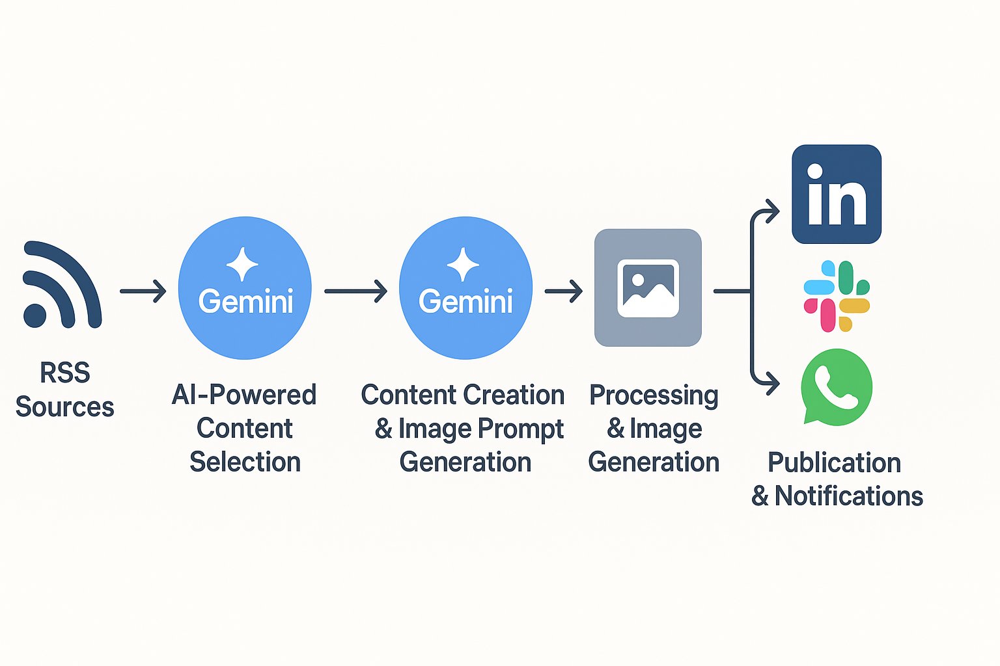
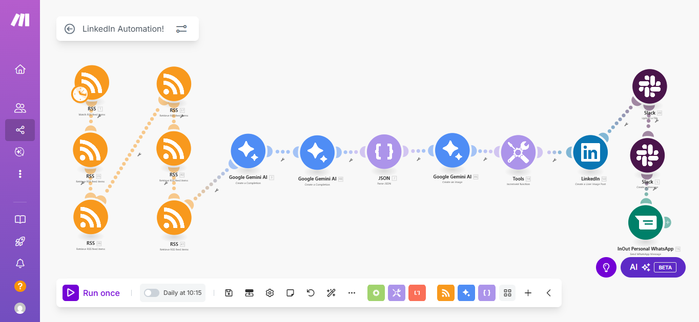

# LinkedIn AI Content Agent 🤖

This repository contains all the resources required to build an autonomous AI agent that creates and publishes high-quality content on LinkedIn. The entire workflow runs on Make.com, powered by the Google Gemini API for intelligence and the Imagen 3 model for image generation.

The agent continuously monitors technology news from multiple RSS feeds, selects the most relevant article for a technical audience, generates a LinkedIn-ready post, creates a unique accompanying illustration, and publishes it. Notifications of each publication are then sent across multiple channels.

  


## 🚀 Motivation

This project originated from a single challenge: **Can an intelligent system take over the execution of a professional social media presence, leaving more room to focus on strategy and learning?**

The LinkedIn AI Content Agent is the answer. It goes beyond simple automation by acting as an intelligent extension of professional capabilities—curating information, analyzing it, and creating valuable content autonomously.

-----

## ✨ How It Works

The workflow replicates a structured content creation process, broken into several stages:

### 1. Trigger

The system runs daily at 10:15 AM, initiating the content creation process.

### 2. AI-Powered Content Selection (Gemini Stage 1)

- **Action**: Multiple RSS feeds are scanned for the latest tech news
- **Intelligence**: Articles are evaluated by a Google Gemini module acting as a Senior Content Strategist. Each article is scored based on relevance, depth, and originality for a technical professional
- **Output**: The best article is selected and returned as structured JSON
- **Prompt Location**: `prompts/FirstAIStageSystemPrompt.md`

#### RSS Sources:

- `https://www.technologyreview.com/feed/` (scanned twice, prioritized)
- `https://techcrunch.com/feed/`
- `https://towardsdatascience.com/feed`
- `https://openai.com/blog/rss.xml`
- `https://www.theseattledataguy.com/feed`

### 3. Content Creation & Image Prompt Generation (Gemini Stage 2)

- **Action**: The JSON of the selected article is passed to a second Gemini module
- **Intelligence**: Acting as an Expert LinkedIn Content Writer, this module transforms the article data into a fully developed post
- **Output**: Structured JSON containing:
  - A catchy title
  - The full LinkedIn post (English, professional tone, engaging, reflective)
  - Relevant hashtags
  - A stylized image prompt
- **Prompt Location**: `prompts/SecondAIStageSystemPrompt.md`

### 4. Processing & Image Generation

- **Parsing**: The JSON output is separated into individual fields (title, content, hashtags, image prompt, etc.)
- **Imagen 3**: A call is made to Google’s Imagen 3 model (generate-002) using the image prompt to create a unique illustration

### 5. Publication & Notifications

- **Post Numbering**: A counter increments with each publication (e.g., “🤖 Daily AI Post N° X!”)
- **LinkedIn**: The post is assembled with the AI-generated text, illustration, and source link, then published automatically
- **Notifications**:
  - **Slack**: A full copy of the LinkedIn post (text + image)
  - **WhatsApp**: A simplified notification containing the post number and title

-----

## 🛠️ Tech Stack

- **Orchestration**: Make.com
- **Intelligence & Writing**: Google Gemini API
- **Image Generation**: Google Imagen 3 (via Google AI Studio / Vertex AI)
- **Platforms**: LinkedIn, Slack, WhatsApp (via InOut)

-----

## ⚙️ Setup Guide

### Prerequisites

1. **Make.com Account** (plan supporting advanced scenarios)
1. **Google Gemini API Key** (from Google AI Studio)
1. **Imagen 3 Access** via Google Cloud with billing enabled (free trial available: 90 days / $300)
1. **Accounts & Access** for LinkedIn, Slack, and a WhatsApp gateway (e.g., InOut), all connected in Make.com

### Installation Steps

1. **Clone the Repository**:
   
   ```bash
   git clone https://github.com/PrincessNosawem/automate-linkedIn-posts
   ```
1. **Import the Blueprint in Make.com**:
- Create a new scenario
- Open the control panel, select Import Blueprint, and upload `make_blueprint.json`
1. **Configure Connections**:
- Reconnect each module with personal accounts (Google, LinkedIn, Slack, WhatsApp, etc.)
1. **Load System Prompts**:
- Copy the contents of `prompts/first_stage_system_prompt.md` into the first Gemini module
- Copy the contents of `prompts/second_stage_system_prompt.md` into the second Gemini module
1. **Customize RSS Sources**:
- Update RSS modules with the feeds you want to monitor
1. **Activate the Scenario**:
- Save and turn on the scenario. The LinkedIn AI Content Agent will now operate autonomously

-----

## ⚖️ License

This project is distributed under the MIT License. See the [LICENSE](LICENSE) file for more details.
